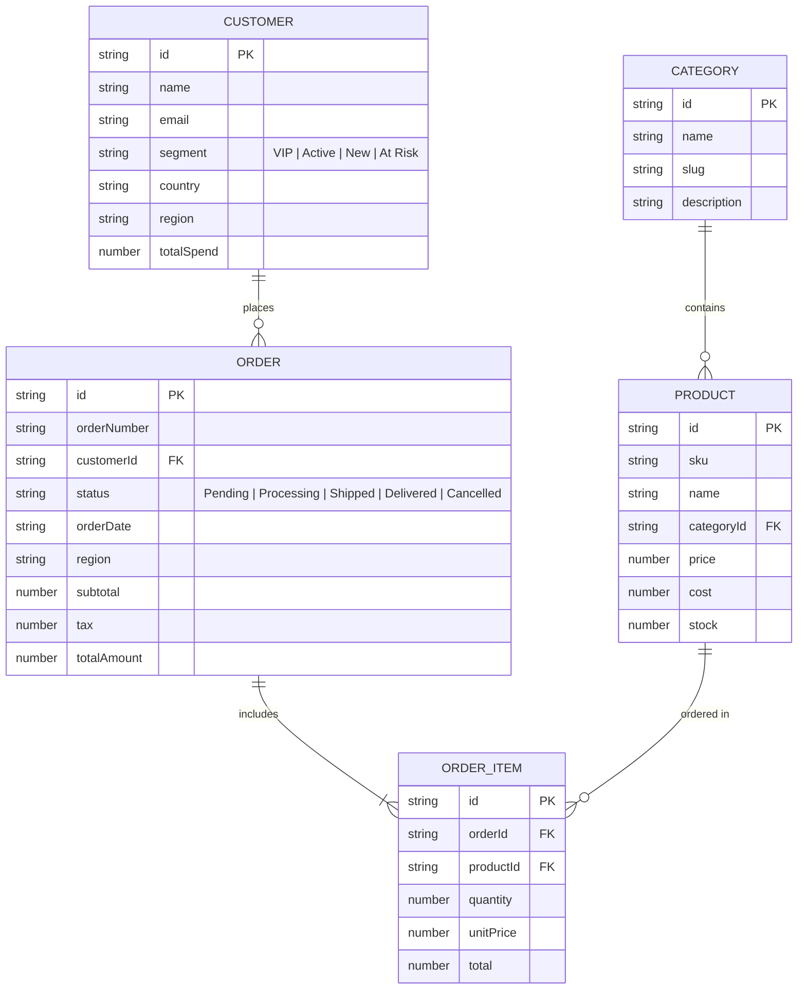

# Command Center — Enterprise SaaS Analytics Platform

Command Center is a high-performance, enterprise-grade B2B SaaS commerce analytics and operations management platform. Built on Next.js 16 App Router and React 19, it delivers real-time KPI metrics, ledger exploration, deep catalog intelligence, and role-based data governance with sub-millisecond filtering and server-side authorization.

---

## 1. Project Overview

Command Center provides operations and executive teams with an interface for monitoring business health, analyzing multi-channel sales velocity, managing fulfillment ledgers, and extracting audit-ready data. The platform operates seamlessly both in production with Supabase Authentication and in zero-dependency standalone evaluation mode using deterministic seed datasets.

---

## 2. Features

- **Executive Dashboard**:
  - Top-line KPIs: Total Revenue, Total Orders, Average Order Value (AOV), and Gross Margin with period-over-period delta indicators.
  - Interactive Revenue Velocity Trend (Daily, Monthly, Cumulative) powered by Recharts.
  - Multi-dimensional breakdown: Category revenue share and regional sales performance.
  - Recent orders feed with customer attribution and delivery status tags.
- **Horizon & Horizon Filters**:
  - Preset horizons (30 Days, 90 Days, 12 Months) and dynamic multi-dimensional filters (Region, Category, Status, Customer Segment).
  - Bidirectional URL parameter synchronization (`useSearchParams`) for bookmarkable and shareable views.
- **Orders Ledger**:
  - High-density TanStack Table with multi-column sorting, pagination (10, 20, 50 rows), and search.
  - Dynamic column visibility toggles.
  - Direct links to enriched order detail records (`/orders/[id]`) with line items, tax breakdowns, and customer details.
- **Streaming RFC 4180 CSV Export**:
  - Export capabilities for current page view or entire filtered dataset.
  - Spreadsheet formula injection protection (neutralizing `=`, `+`, `-`, `@`).
  - Unicode character preservation and UTF-8 Byte Order Mark (BOM) for native Microsoft Excel compatibility.
  - Strict server-side restriction to `ADMIN` users (`HTTP 403 Forbidden` for Viewers).
- **Product & Customer Catalogs**:
  - Product catalog with real-time stock indicators, profit margins, and sales trajectory.
  - Customer directory with Lifetime Value (LTV) cohort segmentation (`VIP`, `Active`, `New`, `At Risk`).
- **Global Command Palette (`Ctrl+K` / `Cmd+K`)**:
  - Centralized keyboard-driven modal with fuzzy search matching.
  - Permission-aware command pruning (Viewer accounts cannot view or execute admin actions).
  - Keyboard navigation (Arrow keys, Enter, Escape) and dark/light theme switching.
- **Role-Based Access Control (RBAC)**:
  - Unified permission matrix supporting `ADMIN` and `VIEWER` roles.
  - Server-enforced middleware and route handlers; client UI elements strictly reflect server-granted rights.
- **Design System & Theme Engine**:
  - System-aware Dark and Light modes using CSS HSL semantic design tokens.
  - Polished SaaS typography, micro-interactions, responsive mobile drawer navigation, and accessible ARIA attributes.

---

## 3. Tech Stack

- **Framework**: [Next.js 16.3.4](https://nextjs.org/) (App Router, Turbopack, Route Handlers, Server Middleware)
- **UI Library**: [React 19.2.8](https://react.dev/)
- **Language**: [TypeScript 5](https://www.typescriptlang.org/) (Strict Mode)
- **Styling**: [Tailwind CSS v4](https://tailwindcss.com/) & Vanilla CSS Design Tokens
- **Primitives**: [Radix UI](https://www.radix-ui.com/) (Dialog, Dropdown Menu, Tooltip, Avatar, Checkbox, Slot)
- **Data Table**: [TanStack Table v8.21.2](https://tanstack.com/table)
- **Data Visualization**: [Recharts v3.10.1](https://recharts.org/)
- **Icons**: [Lucide React](https://lucide.dev/)
- **Authentication**: [@supabase/ssr](https://supabase.com/docs/guides/auth/server-side/nextjs) + HMAC-SHA256 Session Crypto
- **Validation**: [Zod v4](https://zod.dev/)

---

## 4. Architecture

```mermaid
graph TD
    Client["Browser Client / React 19"] --> Proxy["Next.js Proxy / Middleware (lib/supabase/middleware.ts)"]
    Proxy -->|HMAC Session Verification| AuthGate{"Authenticated?"}
    AuthGate -->|No| LoginRedirect["Redirect /login?redirect=..."]
    AuthGate -->|Yes| RBACGate{"Permission Check"}
    RBACGate -->|Denied (e.g. Viewer on /settings)| ForbiddenRedirect["Redirect /dashboard?error=admin_required"]
    RBACGate -->|Allowed| AppPages["App Pages (Dashboard, Analytics, Orders, Products, Customers)"]
    
    Client -->|Ctrl+K| CmdPalette["Command Registry (lib/commands/registry.ts)"]
    Client -->|Export CSV| ExportAPI["API Route /api/export (app/api/export/route.ts)"]
    ExportAPI -->|Server-Side Auth| ServerAuth["assertPermission(role, 'data:export')"]
    ServerAuth -->|Authorized| CSVGen["CSV Exporter (lib/export/csv-exporter.ts)"]
    ServerAuth -->|Forbidden| Err403["HTTP 403 Forbidden"]
```

### Server/Client Boundaries & Security Layers
1. **Edge/Proxy Middleware (`lib/supabase/middleware.ts`)**: Intercepts every protected request (`/dashboard`, `/analytics`, `/orders`, `/products`, `/customers`, `/settings`), validates the HMAC-SHA256 session signature, refreshes Supabase auth cookies, and blocks unauthorized route access.
2. **Cryptographic Session Crypto (`lib/auth/session-crypto.ts`)**: Generates and verifies session tokens using Web Crypto HMAC-SHA256 with timing-safe constant-time equality comparisons, preventing forgery and timing attacks.
3. **Data Access & Analytics Layer (`lib/analytics/`)**: Pure, side-effect-free analytical computation engine providing period comparisons, velocity trends, and regional aggregation.
4. **Resilience Boundaries**: Root `app/error.tsx`, dashboard `app/(dashboard)/error.tsx`, `loading.tsx` skeletons, and `not-found.tsx` isolate faults and ensure zero white-screen crashes.

---

## 5. Database Model

The domain model follows a normalized relational structure implemented in `lib/data/generator.ts` with referential integrity:



- **Determinism**: Generated via a Mulberry32 pseudo-random number generator (PRNG) guaranteeing reproducible, zero-orphan mock datasets (10 categories, 150 products, 500 customers, 2,000 orders, 3,845 order items spanning 13+ months).
- **PostgreSQL / Supabase Ready**: Matches relational SQL schemas with foreign key constraints on `categoryId`, `customerId`, `orderId`, and `productId`.

---

## 6. Local Setup

### Prerequisites
- Node.js 20.x or higher
- npm 10.x or higher

### Installation
```bash
# 1. Clone repository and navigate to root directory
cd "saas project"

# 2. Install dependencies
npm install

# 3. Create local environment configuration
cp .env.example .env.local

# 4. Start development server
npm run dev
```

Open [http://localhost:3000](http://localhost:3000) in your browser.

### Demo Credentials
Pre-configured for local development and review:

| Role | Email | Password | Permissions |
| :--- | :--- | :--- | :--- |
| **Admin** | `admin@commandcenter.io` | `password123` | Full Access (Dashboard, Analytics, Orders, Products, Customers, CSV Export, Settings) |
| **Viewer** | `viewer@commandcenter.io` | `password123` | Read-Only (Dashboard, Analytics, Orders, Products, Customers; **No Export, No Settings**) |

---

## 7. Environment Variables

All configuration is managed via environment variables documented in `.env.example`:

| Variable | Required | Description | Default / Example |
| :--- | :---: | :--- | :--- |
| `NEXT_PUBLIC_SUPABASE_URL` | Yes (in Prod) | Supabase project URL | `https://your-project.supabase.co` |
| `NEXT_PUBLIC_SUPABASE_ANON_KEY` | Yes (in Prod) | Supabase anonymous client API key | `eyJhbGciOi...` |
| `SESSION_SECRET` | **Yes (in Prod)** | 256-bit secret key for HMAC cookie signing | `openssl rand -base64 32` |
| `NEXT_PUBLIC_SITE_URL` | Optional | Canonical site URL for auth redirects & CORS | `https://commandcenter.yourdomain.com` |
| `SUPABASE_SERVICE_ROLE_KEY` | Optional | Server-only key for administrative operations | `eyJhbGciOi...` |

> [!IMPORTANT]
> In production environments, always generate a high-entropy secret for `SESSION_SECRET` and set real Supabase credentials.

---

## 8. Testing

The codebase includes automated unit, integration, and end-to-end verification suites:

```bash
# Run RBAC permission model unit tests
npm test

# Run complete 40-workflow end-to-end test suite
npm run test:all

# Run static TypeScript type check (zero errors)
npm run type-check

# Run ESLint validation
npm run lint

# Verify dataset referential integrity & financial math
npx tsx scripts/verify-data.ts

# Test RFC 4180 CSV exporter & formula injection neutralization
npx tsx scripts/test-csv-exporter.ts

# Test server-side RBAC authorization & direct 403 enforcement
npx tsx scripts/test-rbac-server.ts
```

---

## 9. Deployment

### Production Build & Local Verification
```bash
# Build the production application
npm run build

# Run the production server locally
npm run start
```

### Vercel Deployment
1. Connect the repository to Vercel.
2. In the Project Settings -> Environment Variables, configure:
   - `NEXT_PUBLIC_SUPABASE_URL`
   - `NEXT_PUBLIC_SUPABASE_ANON_KEY`
   - `SESSION_SECRET` (generate using `openssl rand -base64 32`)
   - `NEXT_PUBLIC_SITE_URL` (set to your Vercel production domain)
3. Deploy. Turbopack compiles static and dynamic routes automatically.

### Container / Docker Deployment
Ensure Node.js 20+ Alpine base image, build using `npm run build`, and expose port 3000 running `npm run start`. Provide `SESSION_SECRET` as a container secret.

---

## 10. Key Engineering Decisions

1. **Zero-Dependency Web Crypto HMAC Authentication**: Rather than importing heavy external JWT libraries, session tokens are signed and verified using native Node.js / Web Crypto API HMAC-SHA256 with timing-safe comparisons.
2. **Server-First Fail-Closed Authorization**: Role restrictions are never solely visual UI toggles. Middleware and API route handlers strictly validate roles (`assertPermission`) and return `403 Forbidden` if a Viewer attempts direct export or settings manipulation.
3. **URL as Single Source of Truth for State**: Filter states (time ranges, categories, search strings, pagination) synchronize bidirectionally with URL search parameters, preserving state on page reloads and allowing link sharing.
4. **RFC 4180 & Excel-Safe CSV Engine**: The export engine handles cell quoting, multi-line strings, Unicode symbols, and dynamically prefixes dangerous spreadsheet formula triggers (`=`, `+`, `-`, `@`) with a single apostrophe to prevent CSV formula injection attacks.
5. **Deterministic PRNG Mock Architecture**: Enables instant offline evaluation, automated testing, and development without requiring external network connectivity, while remaining 1:1 compatible with production relational database schemas.
